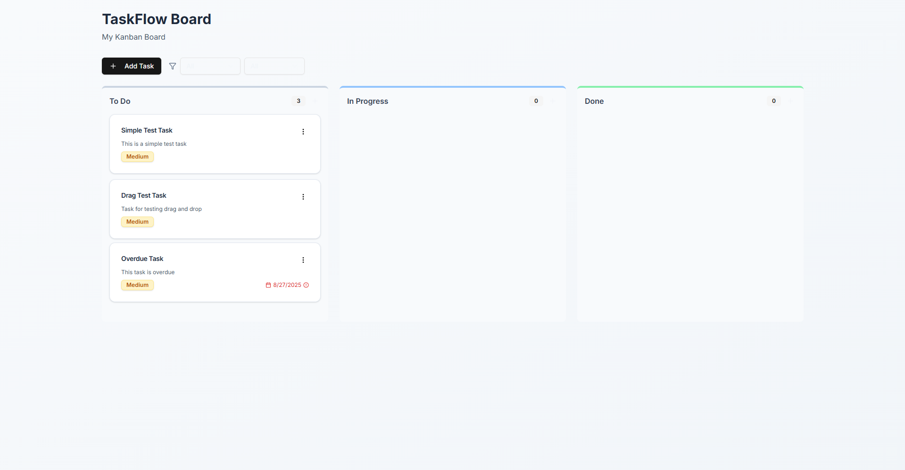

# kanban bord
Backend: FastAPI (Python) · MongoDB · Async I/O · UUID-based IDs · Pytest for testing

Frontend: React 19 · Tailwind CSS · shadcn/ui · Inter font · Vite build

Tooling & DevOps: GitHub Actions (CI) · CORS setup · Env-based config · Toast notifications & form validation
## 📸 Screenshots

  

